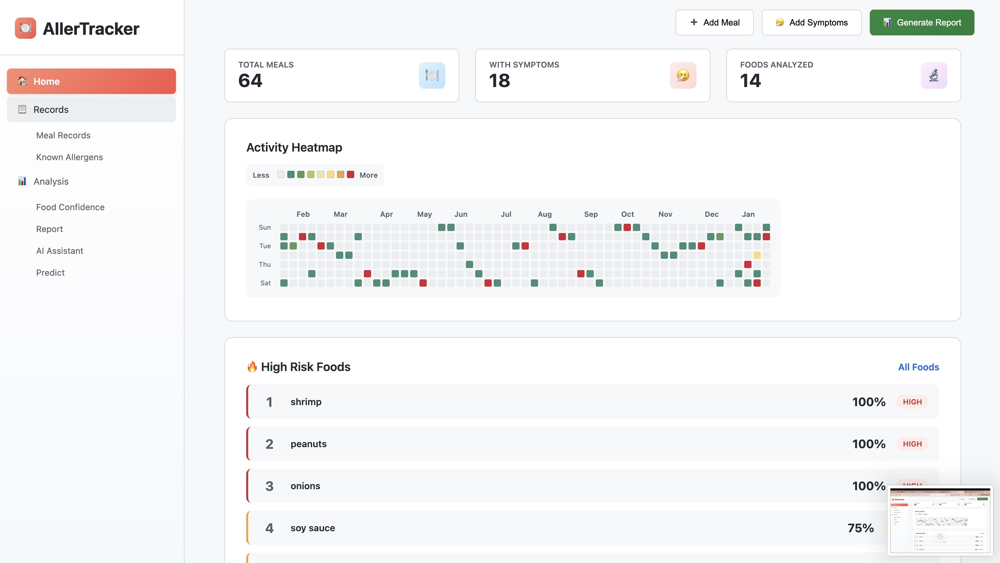
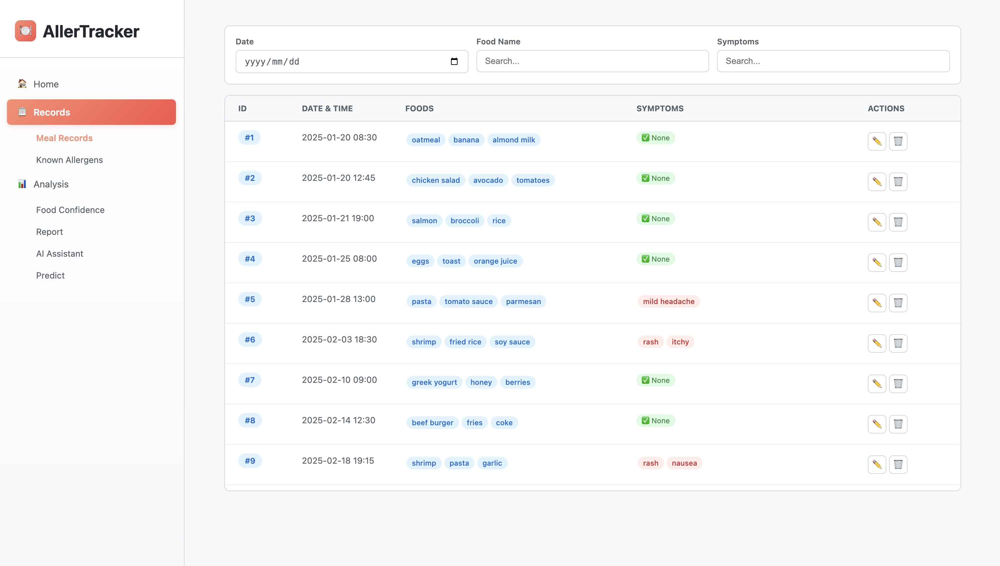
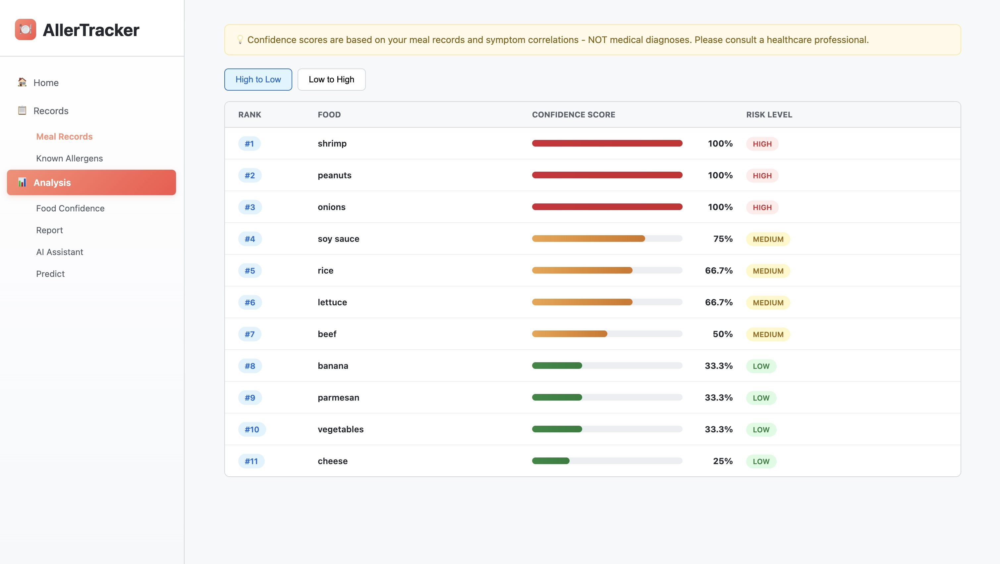
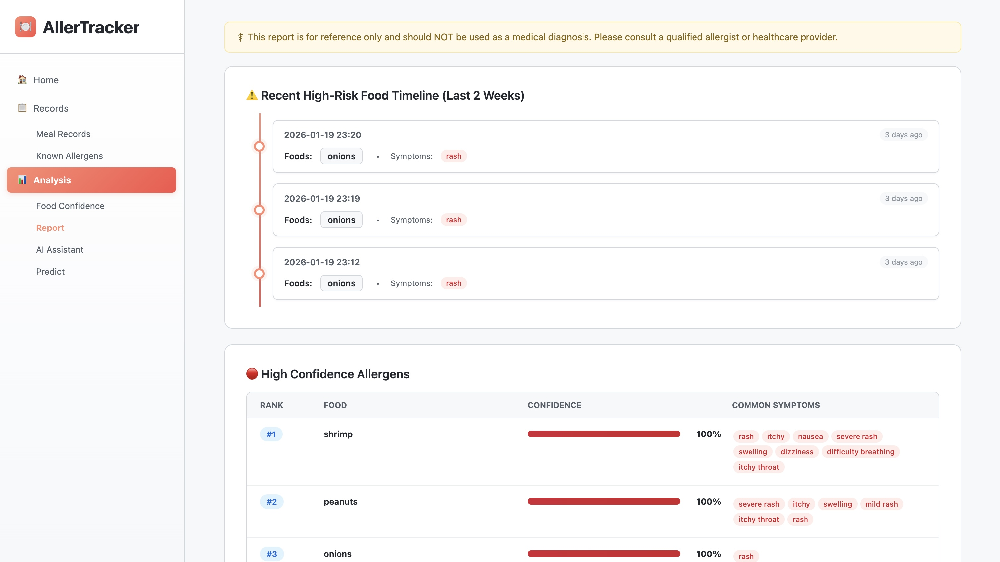
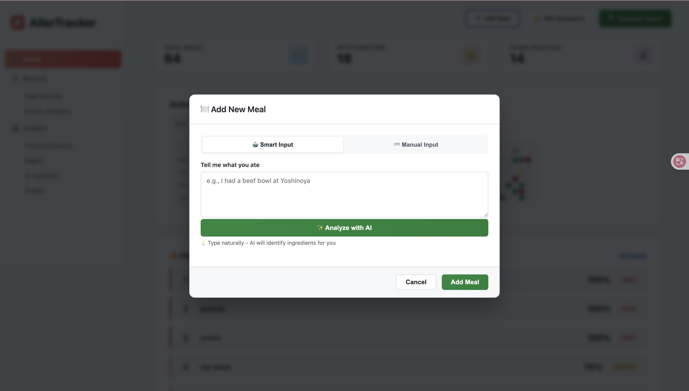
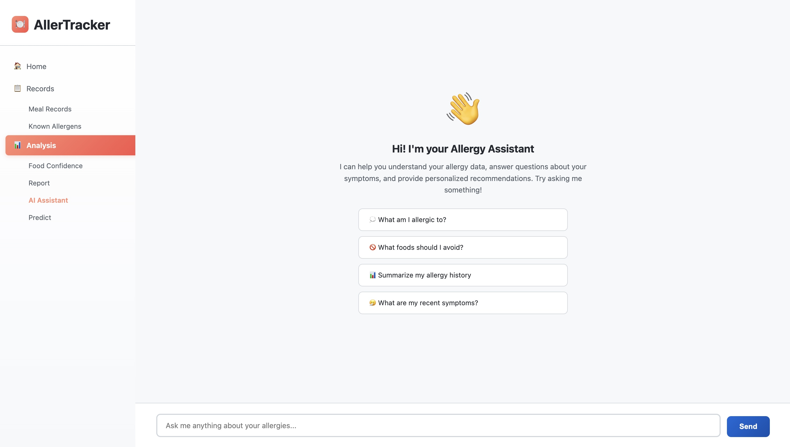
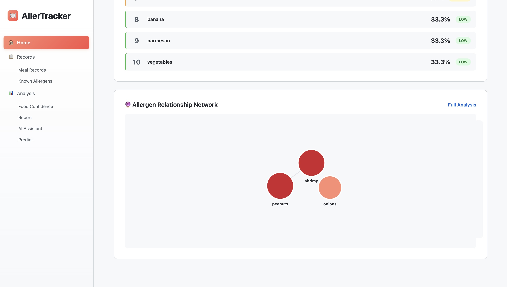

# AllerTracker

A web app for tracking food allergies. Log your meals and symptoms to figure out what you might be allergic to.

## What it does

Track what you eat and any symptoms you get. The app analyzes the data and shows you which foods are most likely causing problems. It's based on statistical correlations - not a replacement for actual allergy testing.

## Screenshots

### Home Dashboard

*Track your meals, view activity heatmap, and see your highest risk foods at a glance*

### Meal Records

*All your meal history with filters for date, food, and symptoms*

### Food Confidence Scores

*Each food ranked by how often it appears with symptoms - higher score = more likely to cause reactions*

### Analysis Report

*Timeline of recent high-risk meals and detailed breakdown of potential allergens*

### Smart Meal Input

*Just type what you ate - AI extracts the ingredients automatically*

### AI Chat Assistant

*Ask questions about your data in plain language*

### Allergen Relationship Network

*Visual map showing which foods appear together with symptoms*

## Key features

- **Smart meal input** - describe what you ate in plain language, AI extracts the ingredients
- **Confidence scores** - foods ranked by how often they appear with symptoms
- **Activity heatmap** - GitHub-style calendar showing your tracking activity
- **AI chat assistant** - ask questions about your allergy patterns
- **Reports** - see timelines of high-risk foods and get testing recommendations
- **Cross-reactivity predictions** - AI suggests related foods you might react to

## Tech stack

Frontend: vanilla HTML/CSS/JavaScript (no frameworks)
Backend: Python with FastAPI

## Setup

### Run locally

1. Clone the repo
```bash
git clone https://github.com/YimingIsCreating/AllerTracker.git
cd AllerTracker
```

2. Start the backend
```bash
cd backend
pip install -r requirements.txt
uvicorn api:app --reload
```

3. Open the frontend

Just open `frontend/index.html` in your browser, or run:
```bash
cd frontend
python -m http.server 8080
```

Then go to `http://localhost:8080`

### Configuration

Edit `frontend/js/config.js`:
```javascript
const CONFIG = {
    API_URL: 'http://127.0.0.1:8000'  // local backend
};
```

For production, change to your deployed backend URL.

## Deployment

**Backend**: Deploy to Render or Railway
- Set root directory to `backend`
- Start command: `uvicorn api:app --host 0.0.0.0 --port $PORT`
- Add environment variable: `GOOGLE_API_KEY` (for AI features)

**Frontend**: Deploy to Vercel or Netlify
- Set root directory to `frontend`
- Update `config.js` with your backend URL

Live demo: https://aller-tracker.vercel.app

## Note

This is a reference tool, not medical advice. If you think you have food allergies, see a doctor. The confidence scores show correlations in your data - they're not diagnoses.

## Background

Built as a final project for CS5001 at Northeastern University. Started because I needed a better way to track my own food sensitivities.

## License

MIT

## Author

Yiming Zhou